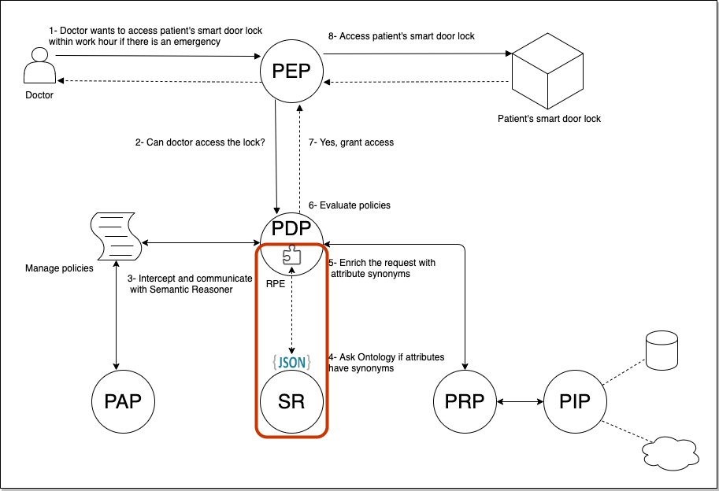
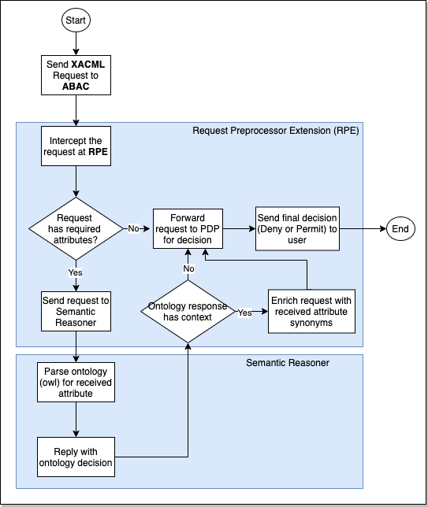

## PDP Request Preprocessor Extension
This is Request Preprocessor extensions tool, developed for processing XACML Requests before evaluation by the PDP engine. 

This extension allows us to intercept the request – even modify it if needed – before evaluated by AccessPolicy. We are in a way pausing the ABAC engine action flow, do necessary work, and resume the flow.

The plugin is a standalone java application packaged as a jar file and placed in already deployed ABAC engine library folder.

Below figure illustrates the deployment point where the tool is deployed. The tool manipulates the XACML requests by extracting the contexts from semantic reasoner. 

The  tool  for  thesis  project  focuses  on  two  attribute  category  ids:   
* urn:oasis:names:tc:xacml:1.0:subject-category:access-subject   
* urn:oasis:names:tc:xacml:3.0:attribute-category:action

Once the plugin is enabled, any request that arrives at PDP is checked if contains any of those category ids. If any attribute is detected, then the plugin intercepts the request and communicates with semantic reasoner to find any synonyms for retrieved attribute. Upon fetching the synonyms, request is refactored by enriching it with received attribute synonyms.

Overall process is described on following figure. 

